# Testing Assignment
## User story 1
As a user I want to be able to create a bar item while on the bar items page
## Happy flow
Given a user is on the application and is on the bar item page when they click
on the add a new bar item button and are on the bar item creation page if
they input the correct information and click submit then a FAQ must be
created.
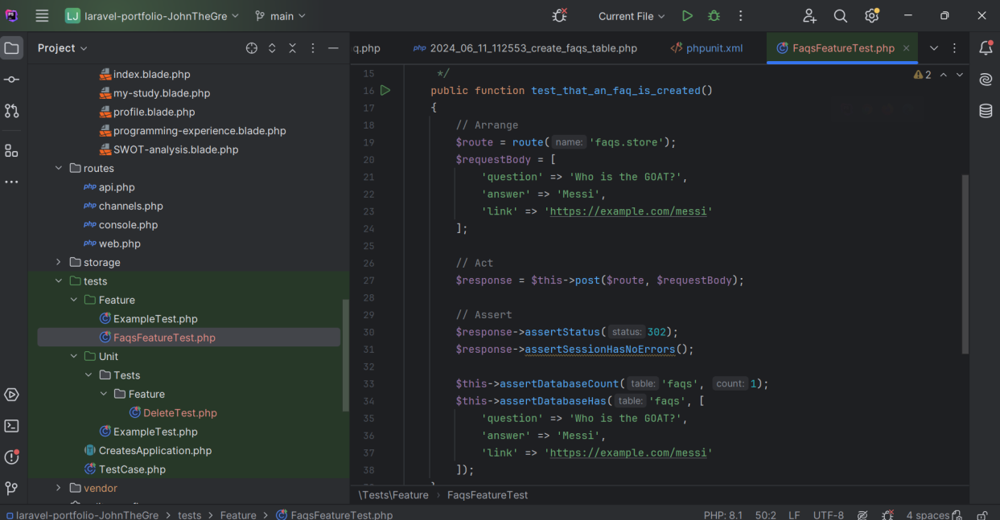

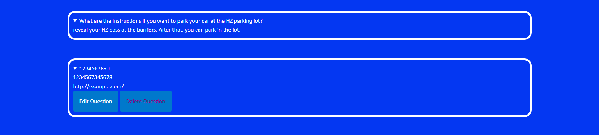
## Unhappy flow
Given a user is on the application and is on the FAQ page when they click on the do you
have any more questions button and are on the FAQ creation page if they input the wrong
information then an error message must appear at the top of the screen.
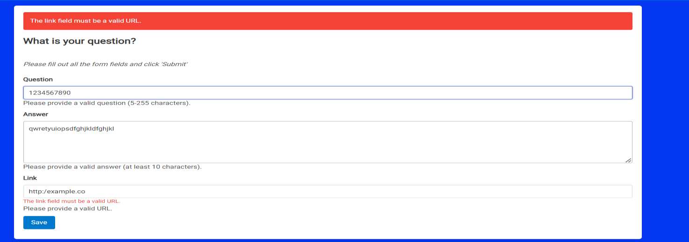
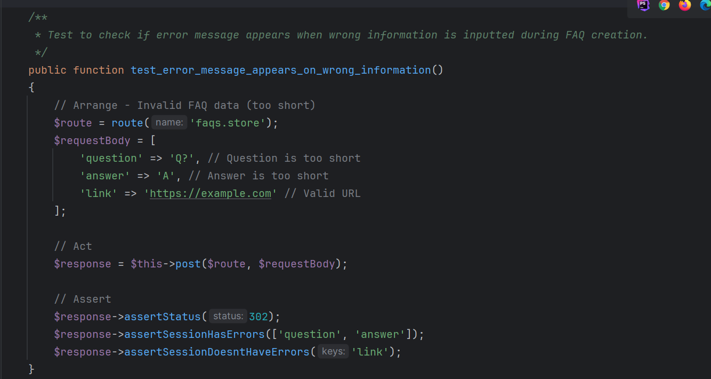
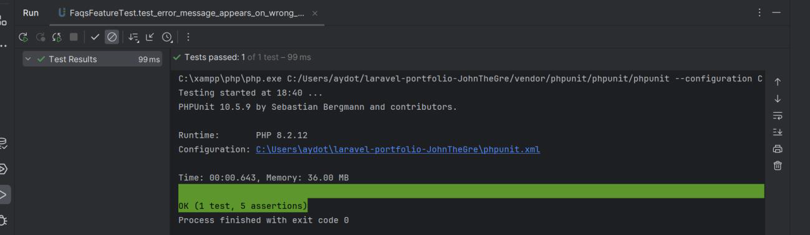
For the unit test it is to test for the deletion of an FAQ when the delete button is clicked
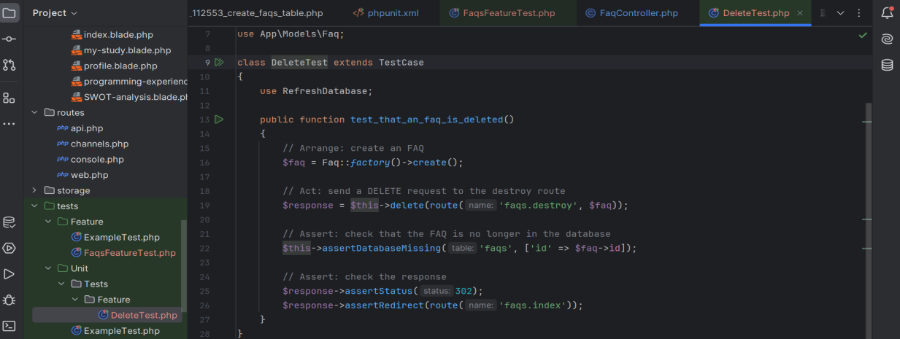

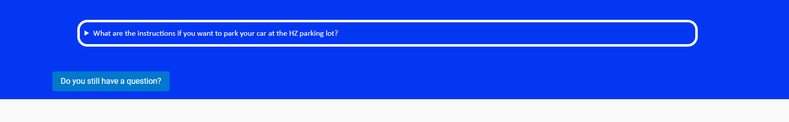
## User story 2
As a user I want to be able to create a blog post while on the blog page
Happy path
Given a user is on the blog page and clicks the add a new blog post button when they input
the correct information within the form and click save then new blog post then the user
must be redirected to the blog index page and a new blog post must be created
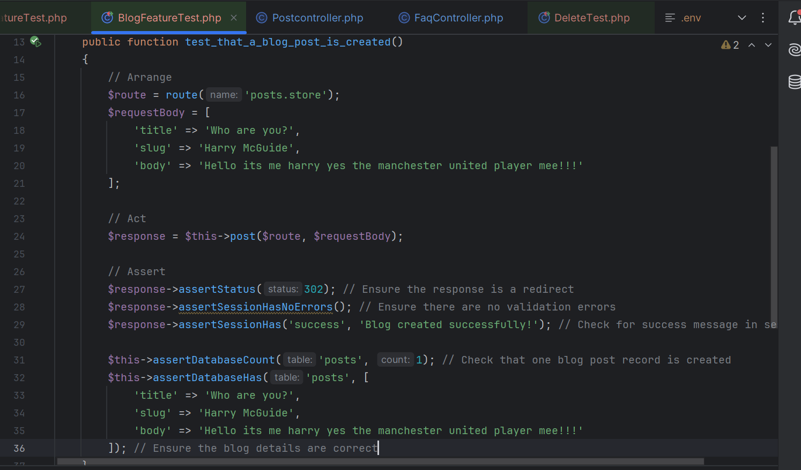
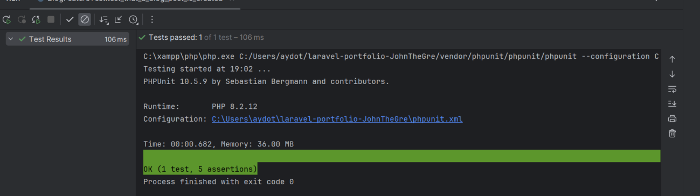
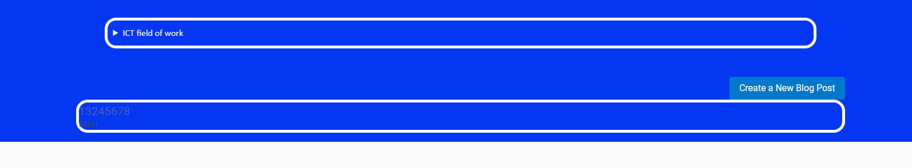
## Unhappy path
Given a user is on the application and is on the bar page when they click on the do you have
any more questions button and are on the bar creation page if they input the wrong
information then an error message must appear at the top of the screen.
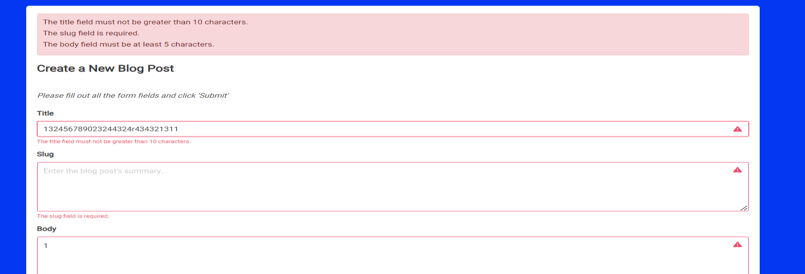
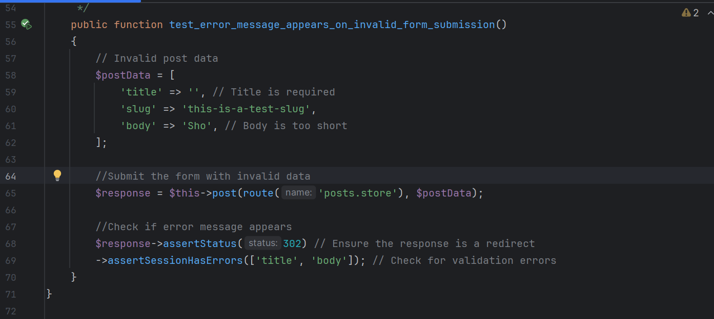
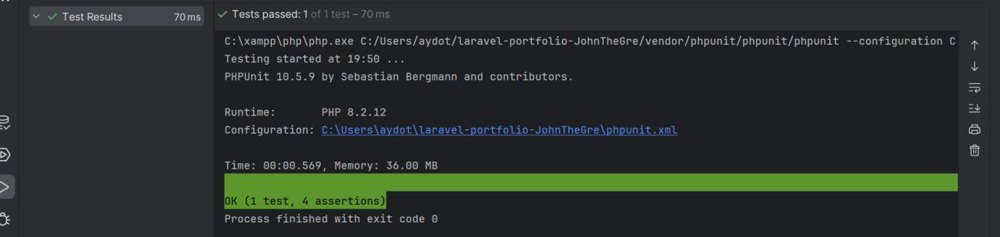
And for the unit test it is to test if the blog post can be deleted
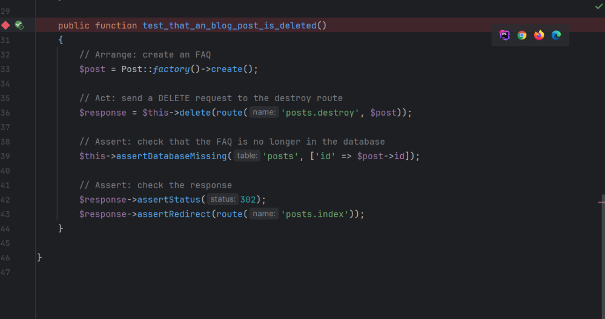
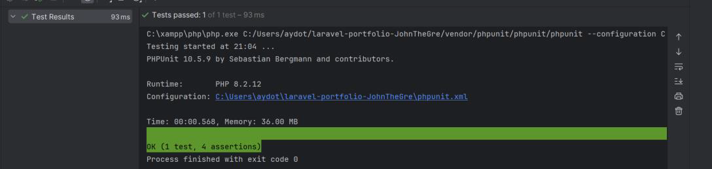

1. Describe a possible mistake/error that can be detected by your test(s)
- My tests ensure that FAQs and blog posts are correctly created and deleted in the
  database. If there is an issue with the database operations (e.g the record is not
  actually created or deleted), your tests will catch this.
- The tests check for the presence of validation errors. If incorrect data is submitted
  and the system does not return validation errors as expected, the tests will fail.
- My tests check that the response after creating or deleting an FAQ or blog post is a
  redirect. If the application fails to redirect properly (e.g due to an incorrect route),
  my tests will(should) catch this.

2. Describe a possible mistake/error that cannot be detected by your test(s)
- A mistake that cannot be detected could be if there are any JavaScript validations or
  client-side logic errors, these will not be caught by my tests. My tests only cover
  server-side validation and logic.
- The tests ensure that FAQs and blog posts are created and deleted correctly in the
  database, but they do not verify the format of the data being submitted. For
  instance, if there is a specific format required for the link field in the FAQ, my tests
  won't catch an incorrectly formatted link if the server-side validation is not
  comprehensive.
- My tests do not check if only authenticated users or users with specific permissions
  can create or delete FAQs and blog posts. If there are rules and permissions
  involved, these aspects cannot be tested.

3. To what extent can you conclude that "everything works correctly"? Provide arguments!
- I can conclude that all my tests work correctly when they directly address what the
  user story is or when they directly address what the customer is asking for. For
  instance, the customer asked for a deletion method for FAQs and posts and for this
  I made a test that tests to see if those methods made work as intended for the
  customer if they do and I believe “everything works correctly” basically as long as
  my test matches the needs/requests of the client or what the client expects of me
  then to me that means everything works correctly.
